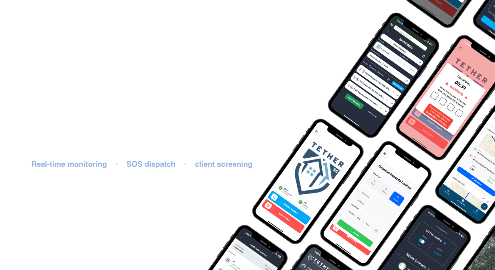
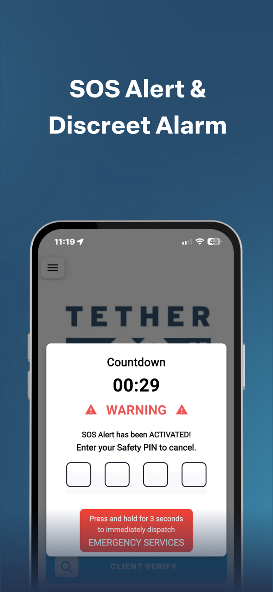
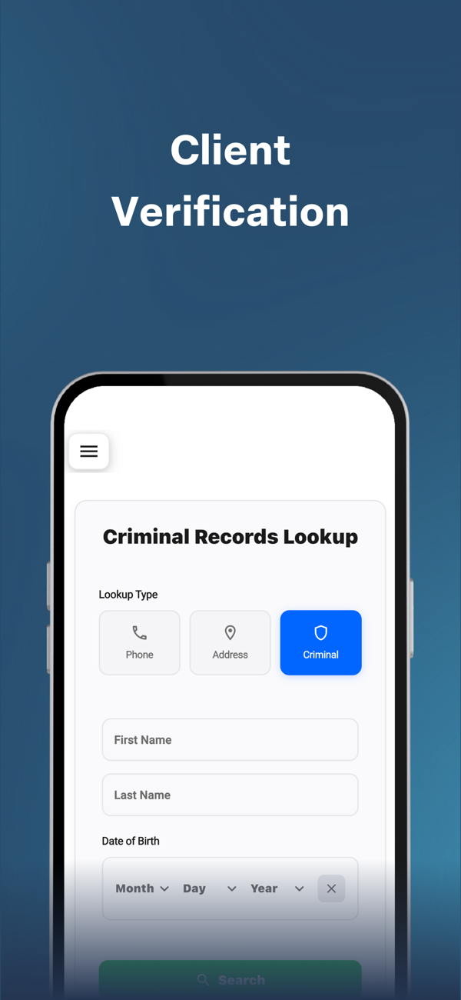
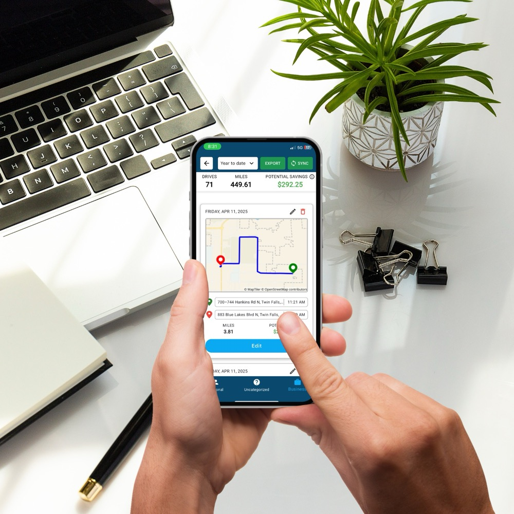
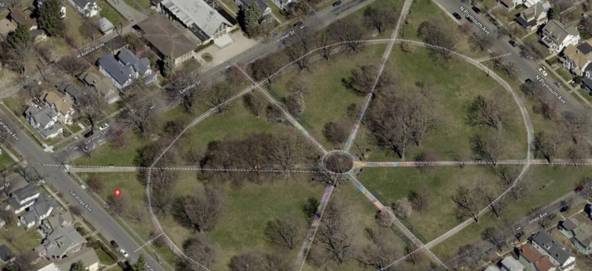

# Brandon DuBois

**Senior Full-Stack Engineer** — AI & agentic systems, GIS & mapping, real estate tech.

Most of my work lives in private repositories. This is a look at what I've shipped.

---

## Tether RE — Real Estate Agent Safety Platform

> *"Because the most important part of any deal is making it home safe."*

[**tetherre.com**](https://tetherre.com) · [App Store](https://apps.apple.com/us/app/tether-re/id1671685723) · [Google Play](https://play.google.com/store/apps/details?id=com.tetherre.app) · Flutter · Web

Real estate agents meet strangers alone, in empty houses, on unfamiliar streets. Tether RE is a personal safety platform built for that reality — continuous monitoring, one-touch emergency dispatch, and client screening that runs from first contact through close.

As **Head of Engineering**, I took over the entire engineering function as the company consolidated to a single engineer, and owned the product from a B2C app through a full pivot to B2B SaaS — reworking the codebase, pricing, and go-to-market.

### Traction

| | |
|---|---|
| **Growth** | 0 → $40K MRR · 5,000 users · multiple enterprise contracts |
| **Recognition** | Won the 2024 T3 Technology Summit Pitch Battle · selected for the NAR REACH Accelerator |
| **Platforms** | Flutter with native iOS & Android modules · web dashboard |

---

### Safety — the core of the product

**24/7 live monitoring.** Professional dispatchers watch sessions in real time and can call EMS even when the agent is unable to speak or reach their phone.

**SOS and silent dispatch.** A tap discreetly notifies emergency contacts. A press-and-hold skips monitoring entirely and dispatches help immediately — built for situations that are already escalating.

**Struggle and impact detection.** On-device sensor analysis flags falls, assaults, and car crashes, then opens a safety protocol automatically.

**Proximity safety timers.** If an agent stays at a property longer than expected, the app checks in on its own.

**Real-time GPS tracking.** Continuous location, streamed to monitoring for the duration of a showing.

 

> **Engineering notes** — I built the app's real-time location layer: live GPS
> tracking, proximity-based safety alarms, and group navigation that keeps an
> agent and their clients synced on the same route in real time. The mapping and
> routing underneath runs on a custom Flutter + MapLibre navigation package I
> wrote after migrating off Mapbox — which cut mapping and routing costs ~90%.

---

### Client verification

Screening happens before the agent ever gets in a car.

- Reverse phone number lookup
- Reverse address lookup
- Criminal background checks
- Sex offender registry checks

Every agent gets 12 free lookups a month.

 

---

### Productivity

Safety gets agents to install the app. These features get them to keep it open.

- Unlimited auto-logged mileage tracking
- AI-powered expense tracking
- Turn-by-turn navigation
- Buyer notes and showing logs
- Showing organizer and dashboard
- Custom branded experience per brokerage

 

> **Engineering notes** — I designed and implemented the AI receipt parsing behind
> expense tracking on AWS Bedrock, so agents can snap a receipt and have the expense
> logged automatically.

---

### Web dashboard & business systems

Brokerage and association administrators manage rosters, branding, and safety reporting from the browser.

> **Engineering notes** — Alongside the COO I architected the company's core
> business systems: StaxBill subscription & enterprise billing with org-hierarchy
> revenue reporting, HubSpot tooling for account management, and UserPilot for
> product analytics. I also built AI-powered analytics dashboards that unified
> billing, user analytics, and revenue into a single view for leadership.

---

## EagleView Cloud — Aerial Imagery & Property Intelligence

At **EagleView** I built GIS-powered web applications across the imagery platform —
both **Cloud Explorer** (viewing, measurement, and analysis of high-resolution aerial
imagery) and **EagleView 3D** (digital-twin mesh models for 3D measurement, line of
sight, and shadow analysis) — on a customized fork of Mapbox.

- **Bridged two geospatial ecosystems** — converted ArcGIS tile data into
  Mapbox-compatible tiles so existing imagery could drive the new platform.
- **Modernized a legacy GIS platform** by migrating core services to a scalable cloud
  architecture, and integrated third-party 3D modeling to extend what enterprise
  customers could analyze.
- **Built a life-safety feature** that lets 911 dispatchers determine a caller's
  elevation *inside* a building during emergency calls.
- Defined API contracts across product and data science, and implemented **Okta SSO**
  for third-party integrations.

Stack: Mapbox · ArcGIS · PostGIS · cloud GIS services · Okta SSO

---

## Stack

| Layer | Technology |
|---|---|
| Mobile | Flutter · Dart · native iOS (Swift) · native Android (Kotlin / Java) |
| Mapping | MapLibre · Mapbox · custom Flutter navigation & routing package |
| Web | React · Next.js |
| Backend | Node.js · NestJS · gRPC · Protocol Buffers |
| AI | AWS Bedrock · Anthropic API · RAG |
| Data | PostgreSQL · PostGIS · Firebase / Firestore |
| Business systems | StaxBill · HubSpot · UserPilot |
| Infrastructure | AWS · Docker · GitHub Actions · GitLab |

My overall stack across Tether RE, EagleView, and other work.

---

## Elsewhere

- **Email** — brandub@gmail.com
- **LinkedIn** — [brandoncodes](https://www.linkedin.com/in/brandoncodes/)
- **GitHub** — [@brandub](https://github.com/brandub)

