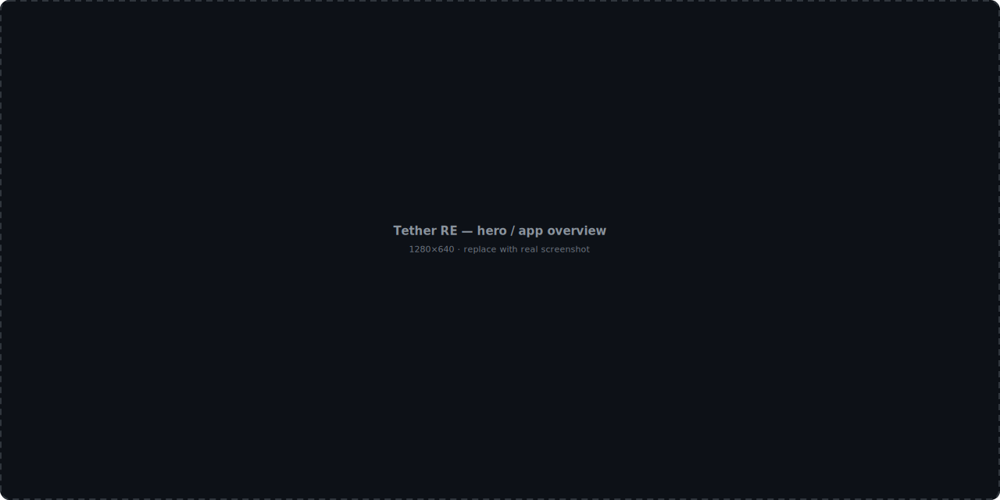
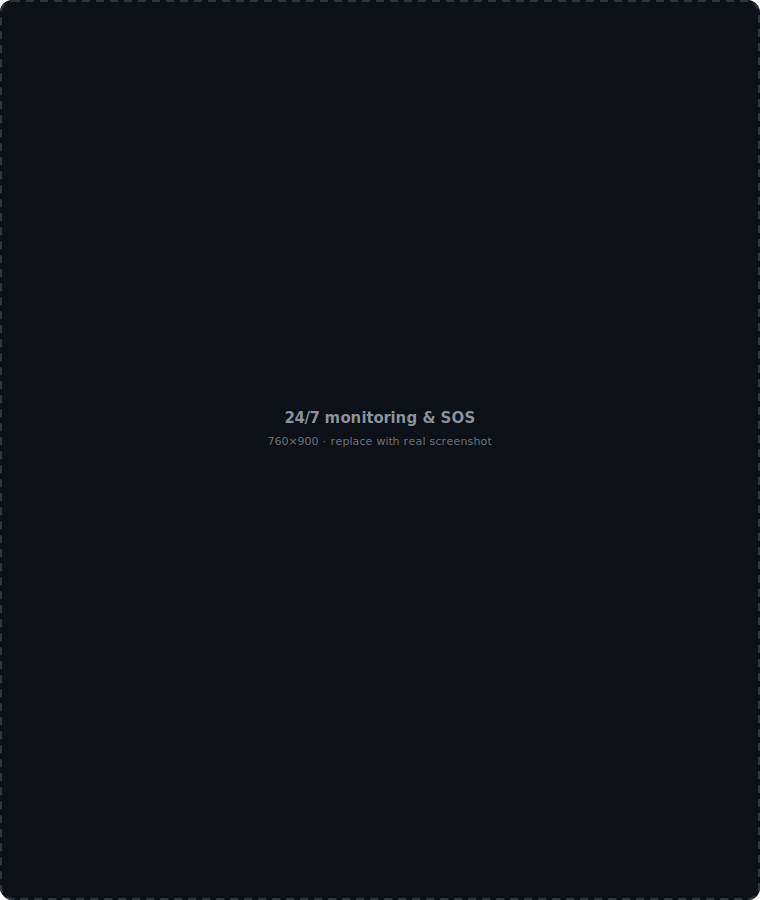
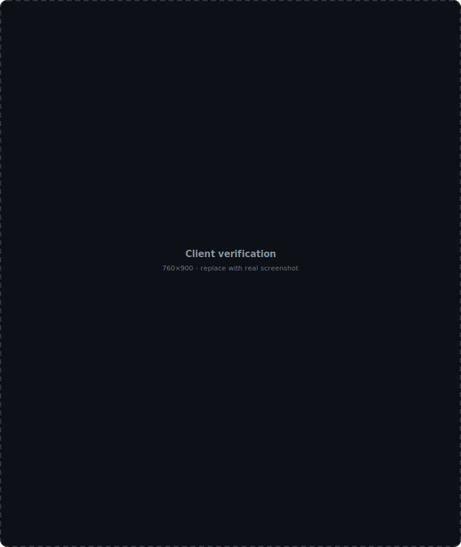
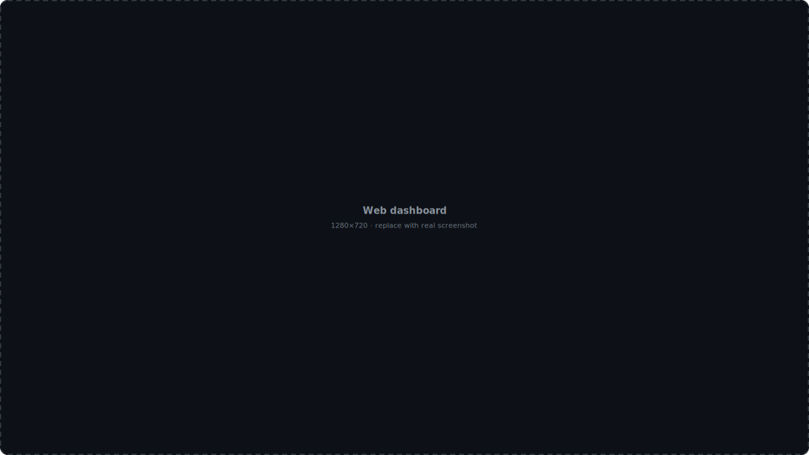

# Brandon DuBois

**Lead Engineer** — I build safety-critical mobile and real-time systems.

Most of my work lives in private repositories. This is a look at what I've shipped.

---

## Tether RE — Real Estate Agent Safety Platform

> *"Because the most important part of any deal is making it home safe."*

[**tetherre.com**](https://tetherre.com) · iOS · Android · Web

Real estate agents meet strangers alone, in empty houses, on unfamiliar streets. Tether RE is a personal safety platform built for that reality — continuous monitoring, one-touch emergency dispatch, and client screening that runs from first contact through close.

I'm the lead engineer. <!-- TODO: one sentence on scope — e.g. "I own the mobile clients, the real-time location pipeline, and the dispatch integration." -->

### Reach

| | |
|---|---|
| **Bright MLS** | Rolled out to 100,000+ subscribers |
| **Associations** | Expanded into 5 new REALTOR® association markets in Q1 2026 |
| **Platforms** | Native iOS, native Android, web dashboard |

---

### Safety — the core of the product

**24/7 live monitoring.** Professional dispatchers watch sessions in real time and can call EMS even when the agent is unable to speak or reach their phone.

**SOS and silent dispatch.** A tap discreetly notifies emergency contacts. A press-and-hold skips monitoring entirely and dispatches help immediately — built for situations that are already escalating.

**Struggle and impact detection.** On-device sensor analysis flags falls, assaults, and car crashes, then opens a safety protocol automatically.

**Proximity safety timers.** If an agent stays at a property longer than expected, the app checks in on its own.

**Real-time GPS tracking.** Continuous location, streamed to monitoring for the duration of a showing.

 

> **Engineering notes**
>
> <!-- TODO: Replace with what you actually built. Some prompts:
>      - How do you stream location continuously without destroying battery life?
>      - What does the false-positive story look like for impact detection?
>      - How does the app stay reliable on bad cell coverage in a basement?
>      - What's the latency budget from SOS press to dispatcher screen?
>      - How do you test a system where a bug means someone doesn't get help?
>      Keep it concrete. Numbers beat adjectives. -->

---

### Client verification

Screening happens before the agent ever gets in a car.

- Reverse phone number lookup
- Reverse address lookup
- Criminal background checks
- Sex offender registry checks

Every agent gets 12 free lookups a month.

 

> **Engineering notes**
>
> <!-- TODO: e.g. data provider integrations, caching/cost strategy, PII handling,
>      compliance constraints (FCRA?), how you keep lookups fast. -->

---

### Productivity

Safety gets agents to install the app. These features get them to keep it open.

- Unlimited auto-logged mileage tracking
- AI-powered expense tracking
- Turn-by-turn navigation
- Buyer notes and showing logs
- Showing organizer and dashboard
- Custom branded experience per brokerage

 

> **Engineering notes**
>
> <!-- TODO: e.g. how auto-logging detects drive start/stop, what the AI expense
>      pipeline actually does (OCR? classification? which model?), offline sync. -->

---

### Web dashboard

Brokerage and association administrators manage rosters, branding, and safety reporting from the browser.

> **Engineering notes**
>
> <!-- TODO: stack, multi-tenancy model, how enterprise rollout to 100k+ users works. -->

---

<!-- TODO: Fill this in and uncomment. Delete any row that doesn't apply.

## Stack

| Layer | Technology |
|---|---|
| iOS | |
| Android | |
| Web | |
| Backend | |
| Data | |
| Real-time | |
| Infrastructure | |

---

-->

## Elsewhere

- **Email** — brandub@gmail.com
- **GitHub** — [@brandub](https://github.com/brandub)
<!-- TODO: add LinkedIn — - **LinkedIn** — https://linkedin.com/in/... -->

